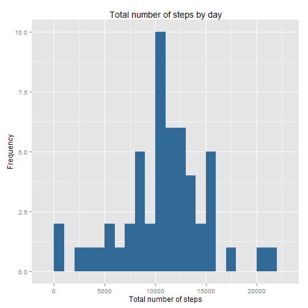
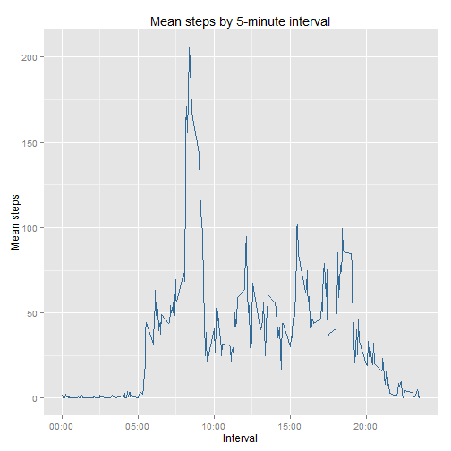
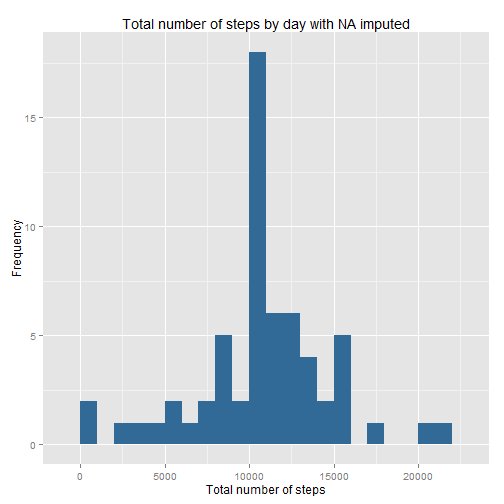
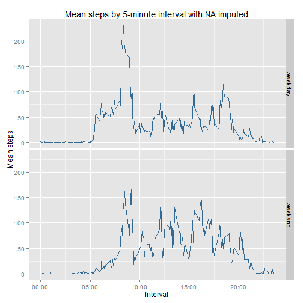

# Reproducible Research: Peer Assessment 1


## Loading and preprocessing the data

- Load the required packages and unzip data (if it isn't already done)


```r
library(ggplot2)
library(reshape2)
library(stringr)

if(!file.exists("activity.csv")){
    unzip("activity.zip")
}
```
- Load the data in a dataframe


```r
rawData <- read.csv("activity.csv")
```

- Preprocess data: convert the date column to Date type

```r
rawData$date <- as.Date(as.character(rawData$date),"%Y-%m-%d")
```

## What is mean total number of steps taken per day?

- Make a histogram of the total number of steps taken each day

```r
dataMelt1 <- melt(rawData, id = "date", measure.var = "steps")
totalSteps <- dcast(dataMelt1, date ~ variable, sum)

qplot(totalSteps$steps,binwidth = 1000, xlab = "Total number of steps", ylab = "Frequency", main = "Total number of steps by day", fill = 1) + theme(legend.position = "none")
```

 

- Calculate and report the mean and median total number of steps taken per day (NA's ignored)

```r
mean(totalSteps$steps, na.rm = TRUE)
```

```
## [1] 10766
```

```r
median(totalSteps$steps, na.rm = TRUE)
```

```
## [1] 10765
```

## What is the average daily activity pattern?

- Make a time series plot (i.e. type = "l") of the 5-minute interval (x-axis) and the average number of steps taken, averaged across all days (y-axis)

```r
dataMelt2 <- melt(rawData, id = "interval", measure.var = "steps",na.rm = TRUE)
meanSteps <- dcast(dataMelt2, interval ~ variable, mean)

qplot(meanSteps$interval, meanSteps$steps, xlab = "Interval", ylab = "Mean steps", main = "Mean steps by 5-minute interval", colour = 1, geom = "line") + theme(legend.position = "none") + scale_x_continuous(breaks = c(0,500,1000,1500,2000),labels = c("00:00","05:00","10:00","15:00","20:00"))
```

 

- Which 5-minute interval, on average across all the days in the dataset, contains the maximum number of steps?

```r
result<-meanSteps$interval[meanSteps$steps == max(meanSteps$steps)]         ##numeric result
result<-str_pad(result,4,"left","0")                                        ##coerced to string with 4 chars
maxInterval <- paste(substr(result,1,2),":",substr(result,3,4),sep="")      ##put in format %H:%M
maxInterval
```

```
## [1] "08:35"
```

## Imputing missing values

- Calculate and report the total number of missing values in the dataset (i.e. the total number of rows with NAs)

```r
sum(is.na(rawData))
```

```
## [1] 2304
```

- Create a new dataset that is equal to the original dataset but with the missing data filled in. (strategy: mean for that 5-minute interval)

```r
tidyData <- rawData
index <- is.na(tidyData$steps)
intervals <- tidyData$interval[index]

##Indexing by intervals
##floor(intervals/100) - count hours
##(intervals %% 100) - separate minutes
tidyData$steps[index] <- meanSteps$steps[floor(intervals/100)*12 + (intervals %% 100)/5 + 1]
```


- Make a histogram of the total number of steps taken each day and Calculate and report the mean and median total number of steps taken per day. Do these values differ from the estimates from the first part of the assignment? What is the impact of imputing missing data on the estimates of the total daily number of steps?

The total daily number of steps increases when I impute missing data, since Im adding new values to the dataframe.


```r
dataMelt3 <- melt(tidyData, id = "date", measure.var = "steps")
newTotalSteps  <- dcast(dataMelt3, date ~ variable, sum)

qplot(newTotalSteps$steps,binwidth = 1000, xlab = "Total number of steps", ylab = "Frequency", main = "Total number of steps by day with NA imputed", fill = 1) + theme(legend.position = "none")
```

 

The mean total number of steps taken per day don't have to change, since I'm adding to the data values equal to the mean by interval. The median, iniatilly, is almost equal the mean and the distribution continues to be simmetric, then it cannot change so much.


```r
mean(newTotalSteps$steps)
```

```
## [1] 10766
```

```r
median(newTotalSteps$steps)
```

```
## [1] 10766
```
## Are there differences in activity patterns between weekdays and weekends?
- Create a new factor variable in the dataset with two levels - "weekday" and "weekend" indicating whether a given date is a weekday or weekend day.

```r
finalData <- tidyData
finalData$week <- weekdays(finalData$date)
weekend <- finalData$week == "sábado" | finalData$week == "domingo"
finalData$week[weekend] <- "weekend"
finalData$week[!weekend] <- "weekday"
finalData$week <- as.factor(finalData$week)
```
- Make a panel plot containing a time series plot (i.e. type = "l") of the 5-minute interval (x-axis) and the average number of steps taken, averaged across all weekday days or weekend days (y-axis). 

```r
dataMelt4 <- melt(finalData, id = c("interval","week"), measure.var = "steps",na.rm = TRUE)
newMeanSteps <- dcast(dataMelt4, interval+week ~ variable, mean)

qplot(data=newMeanSteps, interval, steps, xlab = "Interval",facets = week ~ ., ylab = "Mean steps", main = "Mean steps by 5-minute interval with NA imputed", colour = 1, geom = "line") + theme(legend.position = "none") + scale_x_continuous(breaks = c(0,500,1000,1500,2000),labels = c("00:00","05:00","10:00","15:00","20:00"))
```

 
